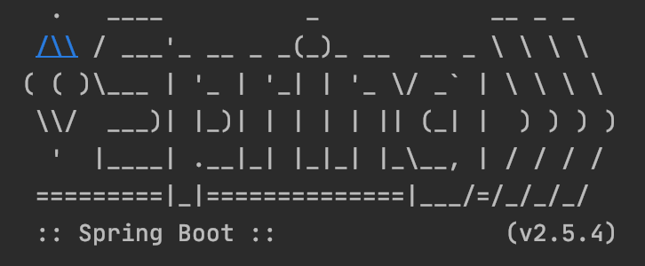

The example project for StringBoot service

<div align="center">
    
</div>

## Project structure
```
.
├── initialization-block
│   ├── pom.xml
│   ...
├── pom.xml
|
└── README.md
```

## Start project

```shell
$ mvn clean package
$ java -jar initialization-block/target/initialization-block-0.0.1-SNAPSHOT.jar
```

```shell
Static initialization block 1
Initialization block 1
Initialization block 2
Contructor 1
```

## Contribute

## Reference